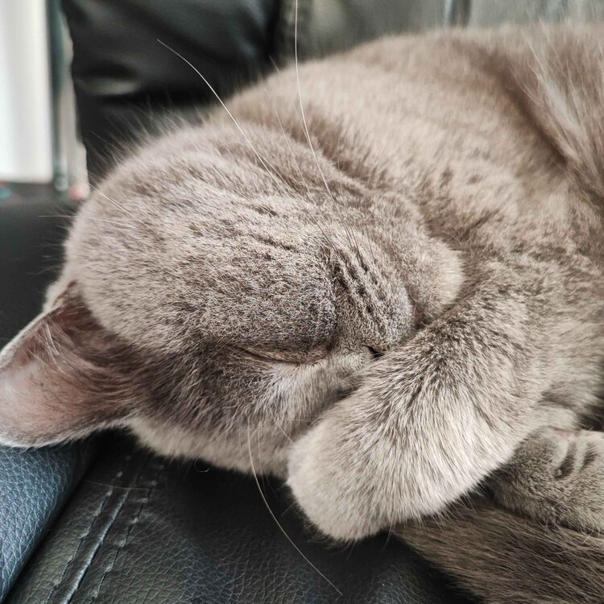

## Hi there👋! I'm Daniel, known as trulyno on the internet.
---

*Yes, a cat as a profile picture. Btw, his name is Kuzuri.*

---

I'm a second-year Computer Science student at the State University of Moldova. I've been passionate about computers since I was a small child, and now I'm studying to create my own apps and projects. One of my biggest successes is my Minecraft modpack, **Star Technology**, which has gained over a quarter of a million downloads!

---

## Interests
- ***Programming*** 💻 - I enjoy coding in my free time.
- ***Gaming*** 🎮 - I love sandbox games and enjoy modifying or even creating my own.
- ***Music*** 🎸 - I'm a self-taught guitarist with an intermediate skill level, and I enjoy indie rock.
- ***Board games*** ♞ - I like playing board games such as Chess, Catan, and Tapestry, and I plan to start a collection.

---

## Programming languages
- **I know:**
    - Java ☕
    - Javascript 🌐
    - C 🔧
    - Python 🐍
- **I'm learning:**
    - Java(*advanced features*)
    - PHP 🛠️
- **Interested in learning:**
    - Rust 🦀
    - Golang 🏎️
    - Kotlin 🚀

---

## Contact
- **Discord:** trulyno
